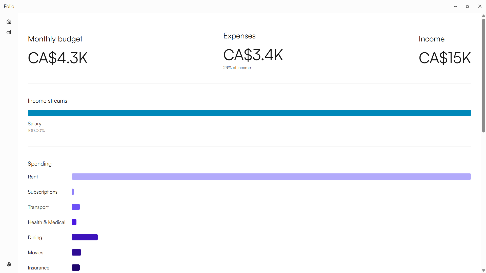
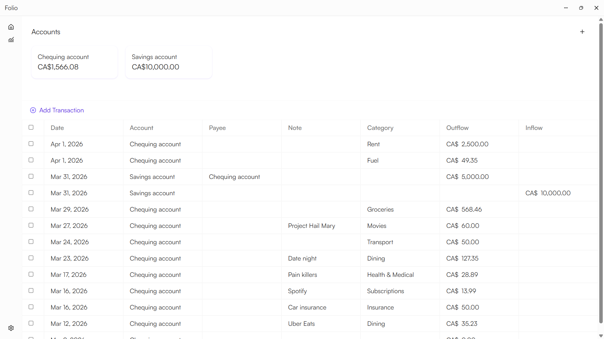

    
    

    <h1>Folio</h1>
    
    

![[art/Analytics.png]]

![[assets/analytics.png]]
## Overview

Folio is a free and open source, personal finance app. It is designed to be simple to use and get out of your way. Folio is local-first, meaning all your sensitive financial data is stored locally on your device. It is a Tauri application, with the frontend written in Svelte and the backend in Rust.  

## Links
- [Website](https://folio.wakunguma.com)
- [Downloads](https://github.com/snubwoody/folio/releases/latest)

## Installation

Folio is supported on all major desktop platforms, i.e. Windows, MacOS and Linux.

| Windows                                                                                                | MacOS                                                                                            | Linux                                                                                              |
| ------------------------------------------------------------------------------------------------------ | ------------------------------------------------------------------------------------------------ | -------------------------------------------------------------------------------------------------- |
| [Exe installer](https://github.com/snubwoody/folio/releases/latest/download/Folio_2.0.0_x64-setup.exe) | [MacOS DMG](https://github.com/snubwoody/folio/releases/latest/download/Folio_2.0.0_aarch64.dmg) | [Deb](https://github.com/snubwoody/folio/releases/latest/download/Folio_2.0.0_amd64.deb)           |
| [Microsoft store](https://apps.microsoft.com/detail/9P5X2HZSXCR1?hl=en-gb&gl=CA&ocid=pdpshare)         |                                                                                                  | [AppImage](https://github.com/snubwoody/folio/releases/latest/download/Folio_2.0.0_amd64.AppImage) |

## Feedback

- Request a new [feature](https://github.com/snubwoody/folio/issues?q=is%3Aissue%20state%3Aopen%20label%3Afeature)
- Report a [bug](https://github.com/snubwoody/folio/issues?q=is%3Aissue%20state%3Aopen%20label%3Abug)
- Start a [discussion](https://github.com/snubwoody/folio/discussions).
- Open an [issue](https://github.com/snubwoody/folio/issues).

## License

All source code is licensed under the GNU General Public License v3.0 or later. See the [LICENSE](LICENSE) file for details.
